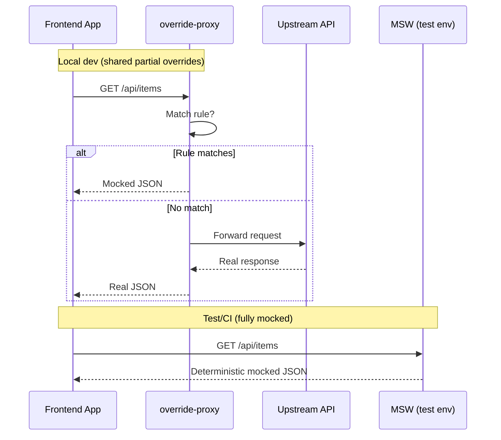

# override-proxy

Pluggable local development server that serves rule-based overrides first, then proxies unmatched requests to an upstream `PROXY_TARGET`.

Key features:

- Override-first: if a rule matches, respond immediately; otherwise proxy.
- Dynamic rule loading from `rules/` (restart handled by nodemon).
- Layered environment loading via `dotenvx` (`.env.local` then `.env.default`).

## Why this instead of (or alongside) MSW?

`override-proxy` and [MSW](https://mswjs.io/) both solve API interception/mocking but sit at different layers: this project is a standalone reverse proxy that applies override rules first and transparently forwards the rest; MSW runs inside your runtime (Service Worker in the browser or a Node process). They are often complementary (team‑wide shared partial overrides via `override-proxy`; fully deterministic isolated tests & Storybook via MSW).

| Aspect | override-proxy | MSW | When to favor override-proxy | When to favor MSW |
| ------ | -------------- | --- | ---------------------------- | ----------------- |
| Deployment form | Standalone Node reverse proxy | In-process (Service Worker / Node) | Need one shared layer for Web, Mobile, backend scripts | Only JS app/tests, want zero base URL changes |
| Override strategy | First matching rule short-circuits, rest passthrough | All requests potentially intercepted; passthrough needs opting in | Partial mock + keep real behavior for the rest | Fully controlled, offline, deterministic data |
| Upstream realism | Unmatched hits real upstream (reduced mock drift) | All data must be defined/generative | Want to reduce divergence between mock and prod | Want fully stable replayable fixtures |
| Team sharing | Point base URL; everyone instantly uses same overrides | Must add handlers per repo | Fast alignment “what’s overridden today” | Single codebase control is enough |
| Client languages | Any (JS, iOS, Android, backend) via HTTP | Primarily JavaScript ecosystems | Multi-language integration workflows | Pure JS/UI workflows |
| Logging & observability | Centralized request log (latency, status, source, rule) | Distributed per environment | Need mixed real+mock traffic insight | Local test verbosity sufficient |
| CORS / network semantics | Real browser/network semantics preserved | Simulated inside SW/Node | Need to validate real cookies/CORS/TLS | Network realism not required |
| Adoption cost | Run one process + point base URL | Install lib + configure handlers in each env | Want zero code intrusion | Prefer inline mocks in tests |
| Extensibility surface | Natural spot for caching, record/replay, fault/latency injection | Built-in REST/GraphQL/WebSocket already | Need proxy aggregation / caching | Need protocol breadth immediately |
| Non-JS test integration | Any stack via HTTP | Requires JS runtime | Mixed polyglot E2E | JS-only test matrix |

### Key strengths of this project

1. Override‑first with transparent passthrough: author only what you need to change; everything else stays real, reducing maintenance & data drift.
2. Cross‑client sharing: any device or language adopts overrides by switching a base URL (or system proxy).
3. Low intrusion: no library embedded in the app—easy to adopt or discard.
4. Real network conditions: genuine CORS, cookies, caching, TLS; good for integration sanity checks.
5. Flexible rules: an override is just an Express handler—inject latency, errors, dynamic data, conditional passthrough.
6. Layered env loading: safe defaults in `.env.default`, secrets in `.env.local` (git‑ignored).
7. Evolution friendly: ideal anchor point for future record & replay, metrics, runtime toggles, chaos/fault injection, priority control.
8. Short learning curve: minimal API (`rule()` + file export); experienced Node/Express users are productive immediately.

### Typical combined workflow with MSW

- Day-to-day team development: run `override-proxy` for shared partial overrides + live upstream behavior.
- Test / CI: use MSW for 100% deterministic, offline, fast tests.
- Demo / Storybook: point at `override-proxy` for realistic hybrid data; fall back to MSW when full offline determinism needed.

> Summary: `override-proxy` is a shared, real-network, partial-override layer; MSW is an in-process, fully controllable interception layer. They complement rather than exclude each other.

### Architecture & Flow (Mermaid)

```mermaid
flowchart LR
  subgraph Client
    A[Request]
  end
  A --> B[override-proxy]
  B -->|First matching rule| C[Override Handler\n(dynamic JSON / delay / error)]
  B -->|No rule matched| U[(Upstream API)]
  C --> R[Response]
  U --> R
  R --> A

  classDef override fill=#0d6efd,stroke=#084298,stroke-width=1,color=#fff;
  class B override;
```

### Complementary Usage with MSW



## Table of Contents

1. Quick Start
2. Environment Variables
3. Rule System
4. Examples
5. Built‑in Endpoints
6. Development Workflow
7. Project Structure
8. Common Scenarios
9. Security Notes
10. Extension Ideas
11. License

## 1. Quick Start

```bash
pnpm install
pnpm dev
```

Smoke test:

```bash
curl http://localhost:4000/__env
```

## 2. Environment Variables

Load order (first wins, no overwrite): `.env.local` → `.env.default`

Sample `.env.default` (do not put secrets here):

```dotenv
PROXY_TARGET=https://pokeapi.co/api/v2/
PORT=4000
# CORS_ORIGINS=http://localhost:3000,https://your-app.local
```

| Name         | Description                                     | Default                      |
| ------------ | ----------------------------------------------- | ---------------------------- |
| PROXY_TARGET | Upstream target when no rule matches            | <https://pokeapi.co/api/v2/> |
| PORT         | Preferred port (auto-increments if busy)        | 4000                         |
| CORS_ORIGINS | Allowed origins (comma list, empty = allow all) | (empty)                      |

> Put secrets only in `.env.local` (ignored by git). `.env.default` is committed and should remain non-sensitive.

## 3. Rule System

Interface:

```ts
interface OverrideRule {
  name?: string;
  enabled?: boolean;      // default true
  methods: [Method, ...Method[]]; // non-empty, uppercase
  test(req: Request): boolean;
  handler(req: Request, res: Response, next: NextFunction): void | Promise<void>;
}
```

Helper creation styles:

1. Overload form:

```ts
rule(method: string | string[], path: string | RegExp, handler, options?)
```

1. Config object form:

```ts
rule({ path?: string|RegExp, test?: (req)=>boolean, methods?: string[], name?, enabled?, handler })
```

Constraints:

- Provide either `path` or `test` (if both given, `test` augments path match logic you control).
- If `methods` omitted in config form it defaults to `["GET"]`.
- First matching enabled rule short-circuits.

Export patterns:

1. `export default rule(...)`
1. `export const rules = [ rule(...), ... ]`
1. Multiple plain objects each with `test` & `handler` (discouraged unless custom logic per object)

## 4. Examples

### 4.1 Simple path

```ts
import { rule } from "../utils.js";
export default rule({
  name: "ping",
  path: "/__ping",
  methods: ["GET"],
  handler: (_req, res) => res.json({ ok: true, t: Date.now() }),
});
```

### 4.2 RegExp capture

```ts
import { rule } from "../utils.js";
export default rule({
  name: "user-detail",
  path: /^\/api\/users\/(\d+)$/,
  methods: ["GET"],
  handler: (req, res) => {
    const id = req.path.match(/^\/api\/users\/(\d+)$/)![1];
    res.json({ id, name: `User ${id}`, from: "override" });
  },
});
```

### 4.3 Custom test

```ts
import { rule } from "../utils.js";
export const rules = [
  rule({
    name: "feature-core",
    test: (req) =>
      req.method === "GET" &&
      req.path === "/feature-controls" &&
      req.query["only"] === "core",
    handler: (_req, res) =>
      res.json({ features: ["core-a", "core-b"], ts: Date.now() }),
  }),
];
```

### 4.4 Disabled rule

```ts
export default rule({
  name: "temp-off",
  path: "/disabled",
  enabled: false,
  handler: (_r, res) => res.json({ off: true }),
});
```

## 5. Built-in Endpoints

| Path     | Method | Description                          |
| -------- | ------ | ------------------------------------ |
| /\_\_env | GET    | Basic non-sensitive environment info |
| \*       | ANY    | Proxy fallback                       |

Logging pattern: `[id] -> METHOD path` / `match ruleName` / completion line with status & source.

## 6. Development Workflow

1. Add / edit files under `rules/`
2. Save → nodemon restarts
3. Inspect startup log for loaded overrides
4. Send requests to validate

Change upstream: set `PROXY_TARGET` in `.env.local`  
Restrict CORS: `CORS_ORIGINS=http://localhost:3000,https://dev.example.com`

## 7. Project Structure

```text
.
├─ main.ts
├─ utils.ts
├─ rules/
│  └─ _demo.ts
├─ .env.default
├─ package.json
├─ tsconfig.json
└─ nodemon.json
```

## 8. Common Scenarios

Simulate latency: `await new Promise(r => setTimeout(r, 800));`  
Conditional pass-through: `handler: (req,res,next)=> req.query["passthrough"]? next(): res.json({x:1})`  
Header trigger: `test: (req)=> req.headers["x-mock-mode"] === "1"`

## 9. Security Notes

- Keep secrets only in `.env.local`.
- Remove or protect `/__env` if exposing externally.
- Rules execute arbitrary code: review sources.
- Avoid exposing this service directly to the public Internet.

## 10. Extension Ideas

| Feature                 | Description                      |
| ----------------------- | -------------------------------- |
| /\_\_rules              | List rules + status + hit counts |
| Runtime toggle          | Enable/disable via PATCH         |
| Hot replace             | chokidar-based in-process swap   |
| Fault / delay injection | Simulate 4xx/5xx/timeout         |
| Stats                   | hit count / last hit timestamp   |
| Priority control        | Explicit rule ordering           |

## 11. License

Apache License 2.0 © 2025 Crescendo Lab. See `LICENSE` for full text.

---

Author: Crescendo Lab — 2025

Need extras (rule listing, runtime toggles, latency/error injection)? Open an issue or ask.
