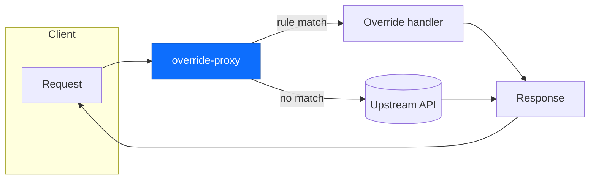
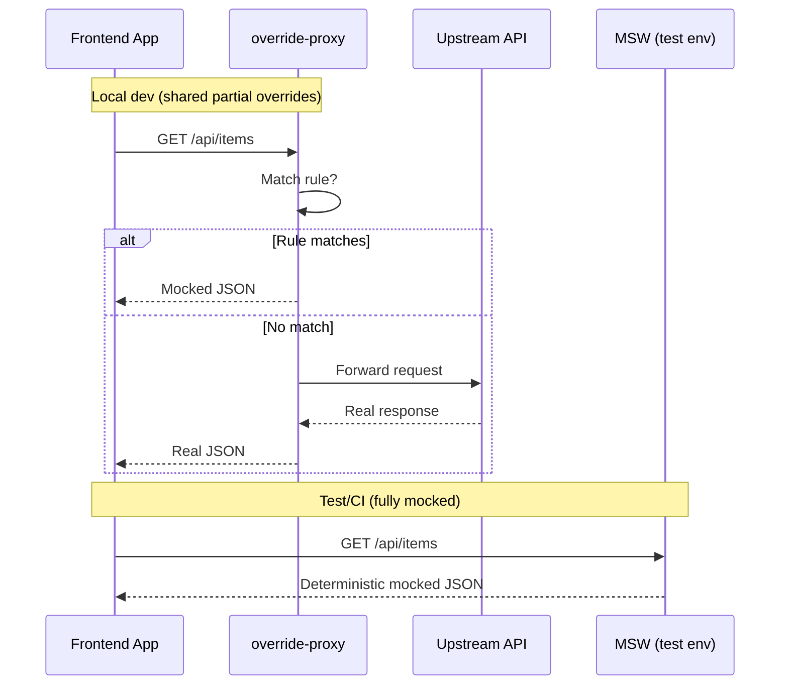

# override-proxy

Pluggable local development server that serves rule-based HTTP and WebSocket overrides first, then proxies unmatched traffic to upstream targets.

Key features:

- Override-first: if a rule matches, respond immediately; otherwise proxy.
- Multi-server, route-scoped config with root and subdirectory routes.
- Inline HTTP and WebSocket rules through config imports.
- Raw WebSocket direct proxy or bridge mode with bidirectional message actions.
- CLI entry with config discovery, `serve`, `validate`, and legacy fallback.
- Layered environment loading via `dotenvx` (`.env.local` then `.env.default`).

## Documentation

| Document                                                                 | Purpose                                            |
| ------------------------------------------------------------------------ | -------------------------------------------------- |
| [README.md](README.md)                                                   | User guide and overview (you are here)             |
| [AGENTS.md](AGENTS.md)                                                   | Detailed guide for AI agents                       |
| [docs/TOOLS.md](docs/TOOLS.md)                                           | Development commands and verification workflow     |
| [docs/ARCHITECTURE.md](docs/ARCHITECTURE.md)                             | Visual diagrams and code location index            |
| [docs/design/config.md](docs/design/config.md)                           | Config model for multi-server routing              |
| [docs/design/websocket.md](docs/design/websocket.md)                     | WebSocket proxy and rule semantics                 |
| [docs/design/cli.md](docs/design/cli.md)                                 | CLI behavior                                       |
| [docs/design/implementation-plan.md](docs/design/implementation-plan.md) | Ordered implementation checklist                   |
| [docs/EXAMPLES.md](docs/EXAMPLES.md)                                     | Copy-paste examples for common scenarios           |
| [docs/PATTERNS.md](docs/PATTERNS.md)                                     | Best practices and common pitfalls                 |
| [docs/DOC-WRITING-GUIDE.md](docs/DOC-WRITING-GUIDE.md)                   | Documentation writing standards (for contributors) |

## Development Tools

The workflow is config-driven: import rule values in config, validate the config,
then run focused tests or the built CLI. See [docs/TOOLS.md](docs/TOOLS.md) for
the current command list.

## Quick Start

Install it in your app or mock workspace:

```bash
pnpm add -D @crescendolab/override-proxy
```

Create `override-proxy.config.ts`:

```ts
import { defineConfig, rule } from "@crescendolab/override-proxy";

const Ping = rule("GET", "/__ping", (_req, res) => {
  res.json({ ok: true, source: "override-proxy" });
});

export default defineConfig({
  servers: [
    {
      port: 4000,
      routes: [
        {
          path: "/",
          target: "https://pokeapi.co/api/v2/",
          http: { rules: [Ping] },
        },
      ],
    },
  ],
});
```

Validate and serve:

```bash
pnpm exec override-proxy validate
pnpm exec override-proxy serve
curl http://localhost:4000/__ping
```

npm users can run the same CLI with `npx @crescendolab/override-proxy`.

## Repository Development

From this source checkout:

```bash
pnpm install
pnpm dev
```

`pnpm dev` runs the CLI serve path through `nodemon`.

Validate a config file without listening:

```bash
pnpm exec tsx cli.ts validate
pnpm exec tsx cli.ts validate --config ./override-proxy.config.ts
```

Build the standalone package entrypoints:

```bash
pnpm run build
node dist/cli.js validate
```

Release workflow:

```bash
pnpm changeset
```

Every user-facing change should include a changeset. After changes land on
`main`, the Release workflow uses Changesets to open a version PR. Merging that
version PR publishes to npm through `pnpm release`; the repository must provide
an `NPM_TOKEN` secret for publishing.

## Environment Variables

Load order (first wins, no overwrite): `.env.local` → `.env.default`

Sample `.env.default` (do not put secrets here):

```dotenv
PROXY_TARGET=https://pokeapi.co/api/v2/
PORT=4000
# CORS_ORIGINS=http://localhost:3000,https://your-app.local
```

| Name         | Description                                     | Default                      |
| ------------ | ----------------------------------------------- | ---------------------------- |
| PROXY_TARGET | Upstream target when no rule matches            | <https://pokeapi.co/api/v2/> |
| PORT         | Preferred port (auto-increments if busy)        | 4000                         |
| CORS_ORIGINS | Allowed origins (comma list, empty = allow all) | (empty)                      |

> Put secrets only in `.env.local` (ignored by git). `.env.default` is committed and should remain non-sensitive.

## CLI And Config Files

The CLI command defaults to `serve`. In this source checkout, run it through `tsx`:

```bash
pnpm exec tsx cli.ts
pnpm exec tsx cli.ts serve --config ./override-proxy.config.ts
pnpm exec tsx cli.ts validate --config ./override-proxy.config.ts
```

After `pnpm run build`, the package exposes `override-proxy` from `./dist/cli.js`. Installed package usage:

```bash
override-proxy
override-proxy serve --config ./override-proxy.config.ts
override-proxy validate --config ./override-proxy.config.ts
```

When consuming the built or installed package, config files can import helpers from `@crescendolab/override-proxy`. In this source checkout before building, import from local source files such as `./config.js`.

Default config discovery checks the current working directory for:

1. `override-proxy.local.config.ts`
2. `override-proxy.local.config.mts`
3. `override-proxy.local.config.js`
4. `override-proxy.local.config.mjs`
5. `override-proxy.config.local.ts`
6. `override-proxy.config.local.mts`
7. `override-proxy.config.local.js`
8. `override-proxy.config.local.mjs`
9. `override-proxy.config.ts`
10. `override-proxy.config.mts`
11. `override-proxy.config.js`
12. `override-proxy.config.mjs`

Local config names are ignored by the repository's default `.gitignore`.

If no config file exists, override-proxy runs in legacy proxy mode using `PROXY_TARGET`, `PORT`, and `CORS_ORIGINS`.

Example multi-route config:

```ts
import { defineConfig } from "./config.js";
import { ApiUser } from "./rules/api-user.js";
import { RootFallback } from "./rules/root-fallback.js";

export default defineConfig({
  servers: [
    {
      name: "main",
      host: "127.0.0.1",
      port: 4000,
      routes: [
        {
          name: "api",
          path: "/api",
          target: "https://api.example.com",
          http: {
            rules: [ApiUser],
          },
          rewrite: { stripPrefix: true },
        },
        {
          name: "root",
          path: "/",
          target: "https://www.example.com",
          http: {
            rules: [RootFallback],
          },
        },
      ],
    },
  ],
});
```

Routes are matched by pathname with priority, longest segment-aware prefix, declaration order, and root fallback.

Config exports can be objects, factories, or async factories:

```ts
import { readFile } from "node:fs/promises";
import { LocalRule } from "./rules/local.js";

export default defineConfig(async () => {
  const fixture = JSON.parse(await readFile("./fixtures/user.json", "utf8"));

  return {
    servers: [
      {
        routes: [{ path: "/", http: { rules: [LocalRule(fixture)] } }],
      },
    ],
  };
});
```

## Rule System

Rules are ordinary JavaScript values attached to config. Put them inline or import them from any module; config may be an object, function, or async function, so filesystem reads and other setup belong in userland config code.

Interface:

```ts
interface OverrideRule {
  name?: string;
  enabled?: boolean; // default true
  methods: [Method, ...Method[]]; // non-empty, uppercase
  test(req: Request): boolean;
  handler(
    req: Request,
    res: Response,
    next: NextFunction,
  ): void | Promise<void>;
}
```

Helper creation styles:

1. Overload form:

```ts
rule(method: Method | readonly Method[], path: string | RegExp, handler, options?)
```

1. Config object form:

```ts
rule({ path?: string|RegExp, test?: (req)=>boolean, methods?: readonly Method[], name?, enabled?, handler })
```

Constraints:

- Provide either `path` or `test` (if both given, `test` augments path match logic you control).
- If `methods` omitted in config form it defaults to `["GET"]`.
- First matching enabled rule short-circuits.

Authoring patterns:

1. `export const SomeRule = rule(...)` and import it from config.
2. Export arrays for scenario packs, then spread them into `http.rules` or `ws.rules`.
3. Use `name` when logs need a stable display value; otherwise the helper derives one from `path` when possible.

## WebSocket Rules

WebSocket support targets raw WebSocket traffic. It does not implement Socket.IO protocol semantics.

Route config supports three modes:

| Mode     | Behavior                                                                 |
| -------- | ------------------------------------------------------------------------ |
| `direct` | Transparent WebSocket proxy using the upstream target                    |
| `bridge` | Accept client socket, optionally connect upstream, and run message rules |
| `mock`   | Accept client socket without opening an upstream connection              |

Bridge and mock message rules use `wsRule()`:

```ts
import { wsRule } from "../../utils.js";

export const PatchChatMessage = wsRule({
  test: (ctx) =>
    ctx.direction === "client" && ctx.jsonObject?.["type"] === "message",
  handler: (ctx) => {
    ctx.emitToClient({ type: "proxy:seen" });
    return ctx.forward({
      ...ctx.jsonObject,
      patchedByProxy: true,
    });
  },
});
```

Each message context includes `raw`, `text`, `json`, `jsonObject`, `direction`, route metadata, request headers, and action helpers. Supported actions are `forward`, `skip`, `emitToClient`, `emitToUpstream`, `close`, and `fail`.

Use `wsConnectionRule()` when the proxy should send messages without waiting for client or upstream traffic, such as welcome events, heartbeat pings, or server-push mocks:

```ts
import { wsConnectionRule } from "../../utils.js";

export const Heartbeat = wsConnectionRule({
  onConnect: (ctx) => {
    ctx.client.send({ type: "proxy:ready" });

    ctx.every(30_000, () => {
      ctx.client.send({ type: "proxy:ping", at: Date.now() });
    });
  },
});
```

The connection context exposes typed `client` and optional `upstream` peers with `send`, `close`, and `readyState`. Advanced rules can use `ctx.raw.client` / `ctx.raw.upstream` for the underlying `ws` sockets. Timers registered with `ctx.every()` and disposers returned from `onConnect()` are cleaned up when the connection closes.

## Examples

### 4.1 Simple path

```ts
import { rule } from "../utils.js";
export default rule({
  name: "ping",
  path: "/__ping",
  methods: ["GET"],
  handler: (_req, res) => res.json({ ok: true, t: Date.now() }),
});
```

### 4.2 RegExp capture

```ts
import { rule } from "../utils.js";
export default rule({
  name: "user-detail",
  path: /^\/api\/users\/(\d+)$/,
  methods: ["GET"],
  handler: (req, res) => {
    const match = /^\/api\/users\/(\d+)$/.exec(req.path);
    if (!match) {
      res.status(404).json({ error: "not_found" });
      return;
    }
    const [, id] = match;
    res.json({ id, name: `User ${id}`, from: "override" });
  },
});
```

### 4.3 Custom test

```ts
import { rule } from "../utils.js";
export const rules = [
  rule({
    name: "feature-core",
    test: (req) =>
      req.method === "GET" &&
      req.path === "/feature-controls" &&
      req.query["only"] === "core",
    handler: (_req, res) =>
      res.json({ features: ["core-a", "core-b"], ts: Date.now() }),
  }),
];
```

### 4.4 Disabled rule

```ts
export default rule({
  name: "temp-off",
  path: "/disabled",
  enabled: false,
  handler: (_r, res) => res.json({ off: true }),
});
```

## Built-in Endpoints

| Path          | Method | Description                           |
| ------------- | ------ | ------------------------------------- |
| `/__env`      | GET    | Legacy non-sensitive environment info |
| `/__override` | GET    | Config-mode server and route snapshot |
| `*`           | ANY    | Route-specific proxy fallback         |

Logging pattern: `[id] -> METHOD path` / `match ruleName` / completion line with status & source.

## Development Workflow

1. Add or edit rule modules.
2. Import the active rules from `override-proxy.config.ts`.
3. Run `pnpm exec tsx cli.ts validate`.
4. Start with `pnpm dev` and send requests to validate behavior.

Change upstream: set `PROXY_TARGET` in `.env.local`  
Restrict CORS: `CORS_ORIGINS=http://localhost:3000,https://dev.example.com`

## Project Structure

```text
.
├─ cli.ts
├─ index.ts
├─ config.ts
├─ server-runtime.ts
├─ http-app.ts
├─ ws-direct-proxy.ts
├─ ws-bridge.ts
├─ main.ts
├─ utils.ts
├─ tests/
├─ .env.default
├─ package.json
├─ tsconfig.json
├─ tsconfig.build.json
└─ nodemon.json
```

## Common Scenarios

Simulate latency: `await new Promise(r => setTimeout(r, 800));`  
Conditional pass-through: `handler: (req,res,next)=> req.query["passthrough"]? next(): res.json({x:1})`  
Header trigger: `test: (req)=> req.headers["x-mock-mode"] === "1"`
WebSocket mock event: `ctx.emitToClient({ type: "proxy:ready" }); return ctx.skip();`

## Security Notes

- Keep secrets only in `.env.local`.
- Remove or protect `/__env` if exposing externally.
- Rules execute arbitrary code: review sources.
- Avoid exposing this service directly to the public Internet.

## Extension Ideas

| Feature                 | Description                      |
| ----------------------- | -------------------------------- |
| /\_\_rules              | List rules + status + hit counts |
| Runtime toggle          | Enable/disable via PATCH         |
| Hot replace             | chokidar-based in-process swap   |
| Fault / delay injection | Simulate 4xx/5xx/timeout         |
| Stats                   | hit count / last hit timestamp   |
| Priority control        | Explicit rule ordering           |

## Rule Organization & Archival

You can still keep rule modules under `rules/`, but runtime does not scan that directory. Config decides exactly which rule values are active.

### 11.1 Group Related Rules

- Group by feature / domain / scenario using either subfolders _and/or_ multi-export files.
- Import the packs you want in `override-proxy.config.ts`.

### 11.2 Disable Single Rule

To temporarily disable a single rule without deleting it, add `enabled: false` to the rule configuration:

```ts
export const UserDetail = rule({
  methods: ['GET'],
  path: /^\/api\/users\/\d+$/,
  enabled: false,
  handler: (req, res) => res.json({ ... })
});
```

The rule remains in config but won't match requests.

### 11.3 Disable an Entire Group

Remove that pack from the config array, or branch inside an async config factory:

```ts
const rules = process.env["MOCK_PACK"] === "checkout" ? checkoutRules : [];
```

### 11.4 Shareable by Design

- Committed config and rule modules are instantly shared—teammates restart and get the same overrides.
- Avoid secrets / PII in responses. Use env vars or synthetic placeholders if needed.
- Scenario-oriented packs let you prepare multiple demo states and enable exactly one by config import or factory branch.

### 11.5 Personal / WIP Rules

- For scratch work you _do not_ want committed, use `override-proxy.local.config.ts` and keep it git-ignored.

### 11.6 Naming Guidance

- Module names: concise, kebab-case domain or scenario (`billing-refunds`, `chat-surge-test`).
- Rule `name` (shown in logs): stable identifier (PascalCase or kebab-case) reflecting purpose.

### 11.7 Quick Lifecycle Table

| Action              | Steps                                 |
| ------------------- | ------------------------------------- |
| Add feature pack    | Create module, import rules in config |
| Disable single rule | Add `enabled: false` to rule config   |
| Disable rule group  | Remove pack from config or branch env |
| Share               | Push config/rule modules and restart  |

### 11.8 Why Inline over Runtime Scanning?

Inline config keeps runtime simple and makes TypeScript point directly at missing imports, wrong rule shapes, and dead code.

## Comparison with MSW

`override-proxy` and [MSW](https://mswjs.io/) both solve API interception/mocking but sit at different layers: this project is a standalone reverse proxy that applies override rules first and transparently forwards the rest; MSW runs inside your runtime (Service Worker in the browser or a Node process). They are often complementary (team‑wide shared partial overrides via `override-proxy`; fully deterministic isolated tests & Storybook via MSW).

| Aspect                   | override-proxy                                                   | MSW                                                               | When to favor override-proxy                           | When to favor MSW                             |
| ------------------------ | ---------------------------------------------------------------- | ----------------------------------------------------------------- | ------------------------------------------------------ | --------------------------------------------- |
| Deployment form          | Standalone Node reverse proxy                                    | In-process (Service Worker / Node)                                | Need one shared layer for Web, Mobile, backend scripts | Only JS app/tests, want zero base URL changes |
| Override strategy        | First matching rule short-circuits, rest passthrough             | All requests potentially intercepted; passthrough needs opting in | Partial mock + keep real behavior for the rest         | Fully controlled, offline, deterministic data |
| Upstream realism         | Unmatched hits real upstream (reduced mock drift)                | All data must be defined/generative                               | Want to reduce divergence between mock and prod        | Want fully stable replayable fixtures         |
| Team sharing             | Point base URL; everyone instantly uses same overrides           | Must add handlers per repo                                        | Fast alignment “what’s overridden today”               | Single codebase control is enough             |
| Client languages         | Any (JS, iOS, Android, backend) via HTTP                         | Primarily JavaScript ecosystems                                   | Multi-language integration workflows                   | Pure JS/UI workflows                          |
| Logging & observability  | Centralized request log (latency, status, source, rule)          | Distributed per environment                                       | Need mixed real+mock traffic insight                   | Local test verbosity sufficient               |
| CORS / network semantics | Real browser/network semantics preserved                         | Simulated inside SW/Node                                          | Need to validate real cookies/CORS/TLS                 | Network realism not required                  |
| Adoption cost            | Run one process + point base URL                                 | Install lib + configure handlers in each env                      | Want zero code intrusion                               | Prefer inline mocks in tests                  |
| Extensibility surface    | Natural spot for caching, record/replay, fault/latency injection | Built-in REST/GraphQL/WebSocket already                           | Need proxy aggregation / caching                       | Need protocol breadth immediately             |
| Non-JS test integration  | Any stack via HTTP                                               | Requires JS runtime                                               | Mixed polyglot E2E                                     | JS-only test matrix                           |

### Key strengths of this project

1. Override‑first with transparent passthrough: author only what you need to change; everything else stays real, reducing maintenance & data drift.
2. Cross‑client sharing: any device or language adopts overrides by switching a base URL (or system proxy).
3. Low intrusion: no library embedded in the app—easy to adopt or discard.
4. Real network conditions: genuine CORS, cookies, caching, TLS; good for integration sanity checks.
5. Flexible rules: an override is just an Express handler—inject latency, errors, dynamic data, conditional passthrough.
6. Layered env loading: safe defaults in `.env.default`, secrets in `.env.local` (git‑ignored).
7. Evolution friendly: ideal anchor point for future record & replay, metrics, runtime toggles, chaos/fault injection, priority control.
8. Short learning curve: minimal API (`defineConfig()` + `rule()` / `wsRule()`); experienced Node/Express users are productive immediately.

### Typical combined workflow with MSW

- Day-to-day team development: run `override-proxy` for shared partial overrides + live upstream behavior.
- Test / CI: use MSW for 100% deterministic, offline, fast tests.
- Demo / Storybook: point at `override-proxy` for realistic hybrid data; fall back to MSW when full offline determinism needed.

> Summary: `override-proxy` is a shared, real-network, partial-override layer; MSW is an in-process, fully controllable interception layer. They complement rather than exclude each other.

### Architecture & Flow (Mermaid)


```mermaid
flowchart LR
  subgraph Client
    A[Request]
  end
  A --> B[override-proxy]
  B -->|rule match| C[Override handler]
  B -->|no match| U[(Upstream API)]
  C --> R[Response]
  U --> R
  R --> A
  %% Behaviors: dynamic JSON, latency, error injection
  classDef proxy fill:#0d6efd,stroke:#084298,stroke-width:1px,color:#fff;
  class B proxy;
```

### Complementary Usage with MSW


```mermaid
sequenceDiagram
  participant DevApp as Frontend App
  participant OP as override-proxy
  participant Up as Upstream API
  participant MSW as MSW (test env)

  Note over DevApp,OP: Local dev (shared partial overrides)
  DevApp->>OP: GET /api/items
  OP->>OP: Match rule?
  alt Rule matches
    OP-->>DevApp: Mocked JSON
  else No match
    OP->>Up: Forward request
    Up-->>OP: Real response
    OP-->>DevApp: Real JSON
  end
  Note over DevApp,MSW: Test/CI (fully mocked)
  DevApp->>MSW: GET /api/items
  MSW-->>DevApp: Deterministic mocked JSON
```

## License

Apache License 2.0 © 2025 Crescendo Lab. See `LICENSE` for full text.

---

Author: Crescendo Lab — 2025

Need extras (rule listing, runtime toggles, latency/error injection)? Open an issue or ask.
