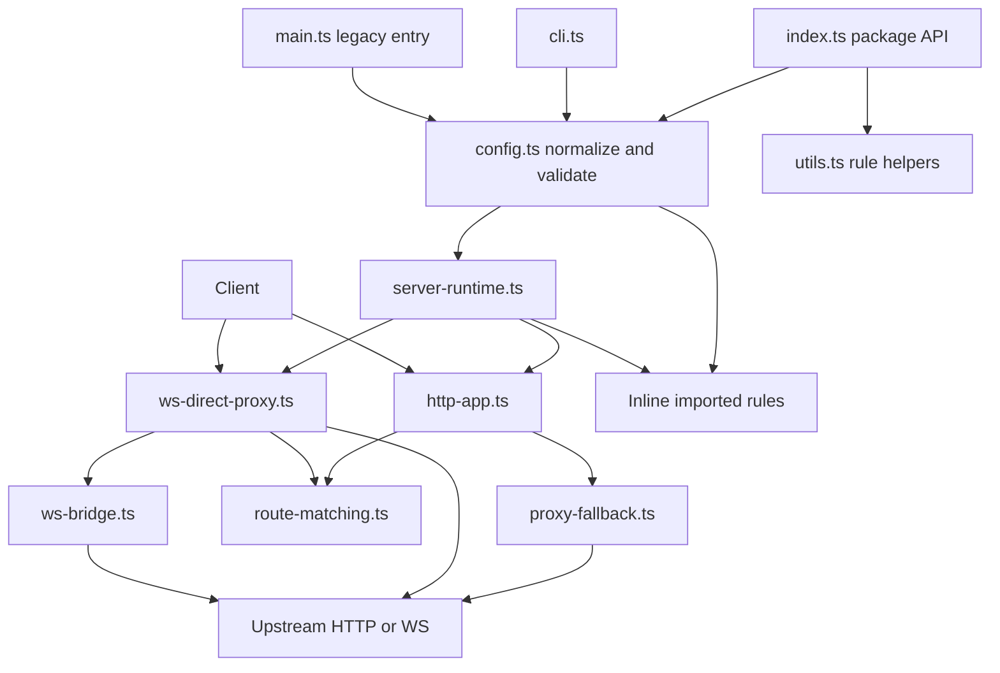
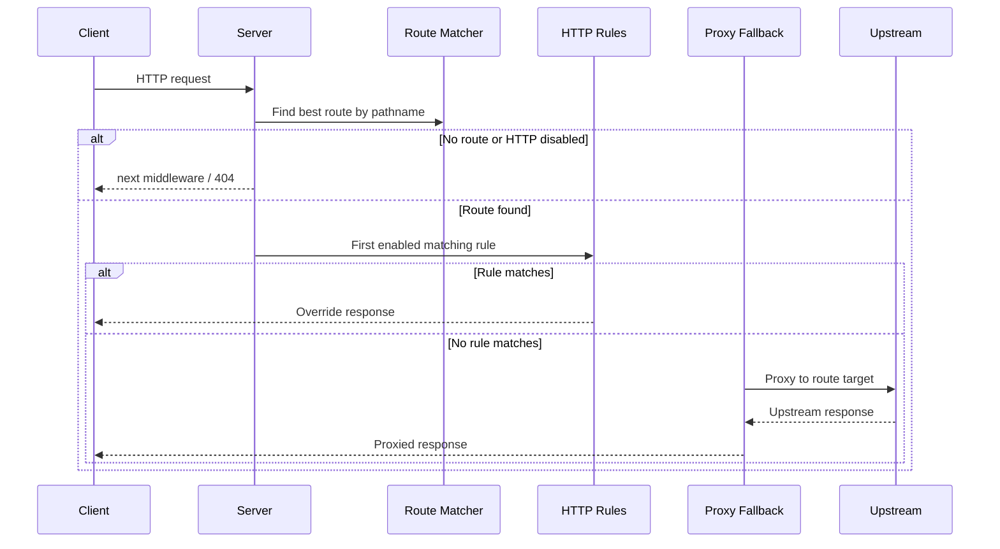
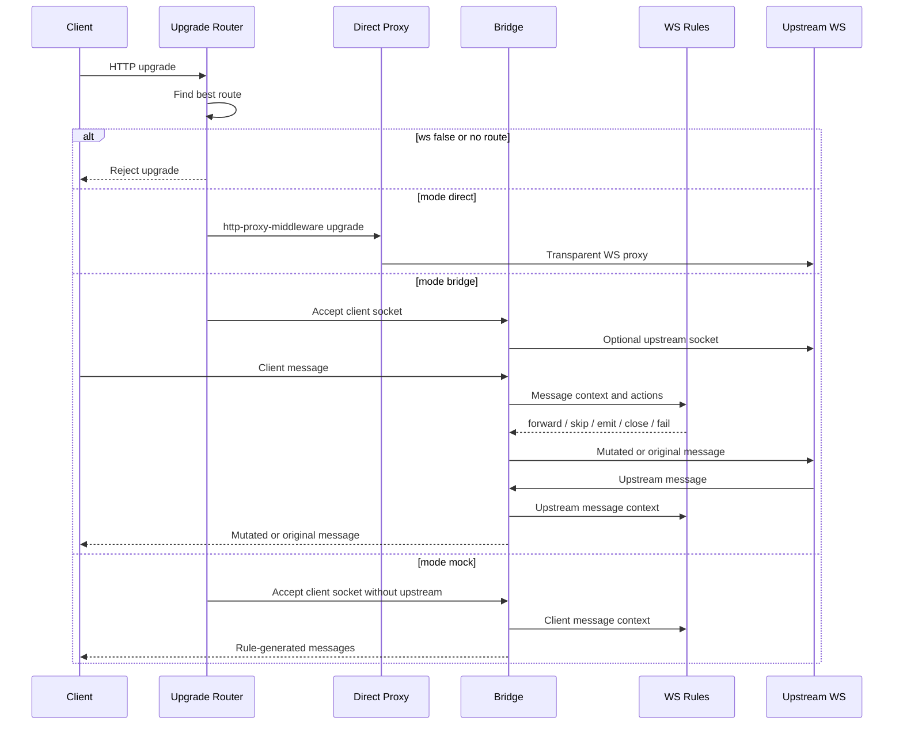

# Architecture

Visual architecture and code location index for the current runtime.

## Runtime Overview



`index.ts` is the side-effect-free package API for config and rule helpers. `main.ts` preserves the legacy public runtime exports: `app`, `overrides`, and `TARGET`. New behavior is built through `cli.ts`, normalized config, and `startConfiguredServers()`.

## HTTP Flow



HTTP rules are route-scoped. A route can have its own target, inline imported rules, and rewrite behavior.

## WebSocket Flow



WebSocket support is for raw WebSocket traffic. Socket.IO is a separate higher-level protocol and is not interpreted by these rules.

## Route Matching

Route matching uses URL pathname only. Query strings do not affect route selection.

Order:

1. Higher `priority`.
2. Longer segment-aware path prefix.
3. Declaration order.
4. `/` root fallback last when priority ties.

Code: [route-matching.ts](../route-matching.ts)

## Core Files

| File                                        | Purpose                                                                      |
| ------------------------------------------- | ---------------------------------------------------------------------------- |
| [index.ts](../index.ts)                     | Side-effect-free package API exports for config and rule helpers             |
| [cli.ts](../cli.ts)                         | CLI command parsing, config discovery, `serve`, `validate`, exit codes       |
| [config.ts](../config.ts)                   | Public config types, legacy env mapping, normalization, validation           |
| [server-runtime.ts](../server-runtime.ts)   | Starts configured servers and attaches WS upgrade handlers                   |
| [http-app.ts](../http-app.ts)               | Express app factory, CORS, control endpoint, route-scoped HTTP dispatch      |
| [ws-direct-proxy.ts](../ws-direct-proxy.ts) | Routes upgrade requests and handles direct WS proxy mode                     |
| [ws-bridge.ts](../ws-bridge.ts)             | Bridge/mock WebSocket runtime, connection hooks, and message action pipeline |
| [proxy-fallback.ts](../proxy-fallback.ts)   | Route-specific HTTP proxy fallback                                           |
| [utils.ts](../utils.ts)                     | `rule()`, `wsRule()`, `wsConnectionRule()`, public rule interfaces           |

## Rule Types

HTTP rules:

```ts
interface OverrideRule {
  name?: string;
  enabled?: boolean;
  methods: [Method, ...Method[]];
  test(req: Request): boolean;
  handler(
    req: Request,
    res: Response,
    next: NextFunction,
  ): void | Promise<void>;
}
```

WebSocket rules:

```ts
interface WebSocketRule {
  name?: string;
  enabled?: boolean;
  test(ctx: WsMessageContext): boolean | Promise<boolean>;
  handler(ctx: WsMessageContext): WsRuleAction | Promise<WsRuleAction>;
}

interface WebSocketConnectionRule {
  name?: string;
  enabled?: boolean;
  test(ctx: WsConnectionContext): boolean | Promise<boolean>;
  onConnect(
    ctx: WsConnectionContext,
  ): void | (() => void) | Promise<void | (() => void)>;
}
```

Config attaches these rule objects inline. Use imports, factory functions, or async config setup to compose rule packs.

## Testing

Current focused tests:

```bash
pnpm exec tsx tests/config.test.ts
pnpm exec tsx tests/http-routing.test.ts
pnpm exec tsx tests/cli.test.ts
pnpm exec tsx tests/ws-direct.test.ts
pnpm exec tsx tests/ws-rules.test.ts
pnpm exec tsx tests/ws-bridge.test.ts
npx tsc --noEmit
```

## Debugging Logs

HTTP:

```text
[1] -> GET /api/users
[1] match UserDetail (api/users.ts:UserDetail)
[1] <- 200 12ms override UserDetail
```

WebSocket:

```text
[ws:1] -> /ws/chat chat
[ws:1] proxy ws://localhost:5001/ws/chat
[ws:1] client match PatchMessage (ws/chat.ts:PatchMessage)
[ws:1] client forward 58b
[ws:1] <- close 1000 42ms
```
