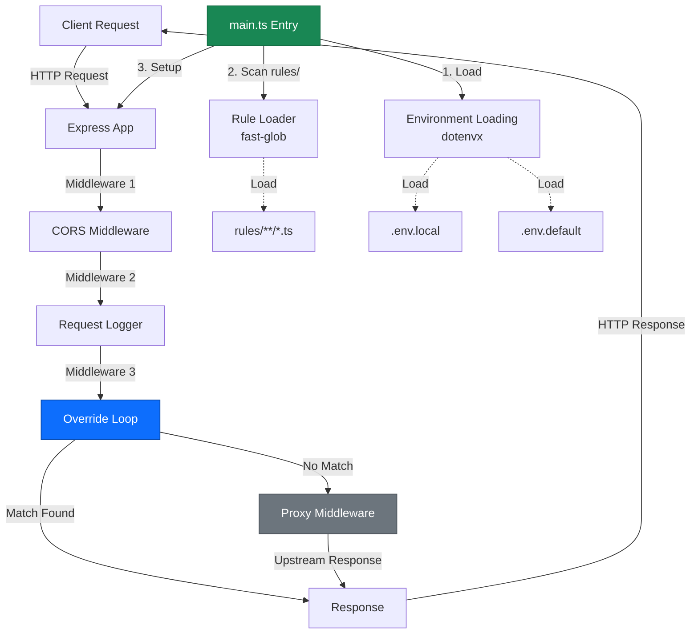
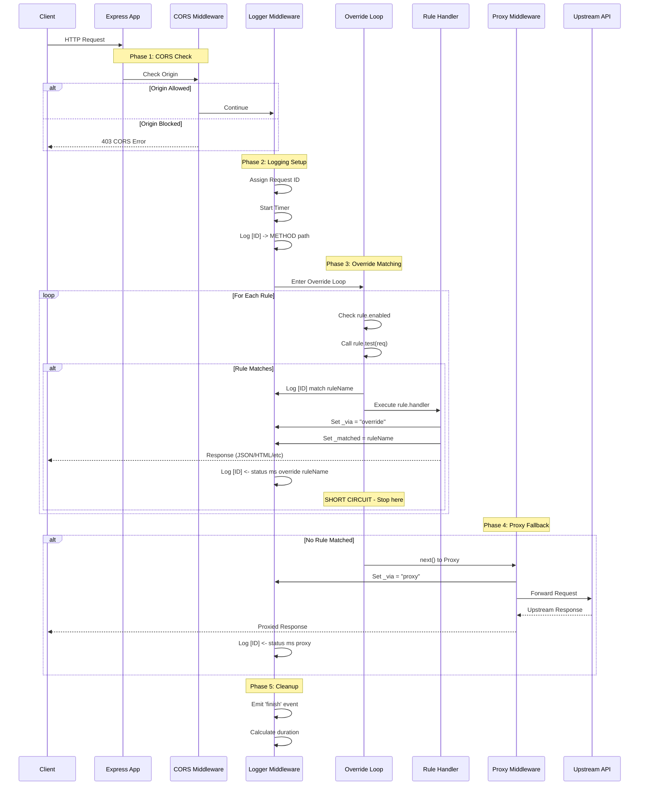
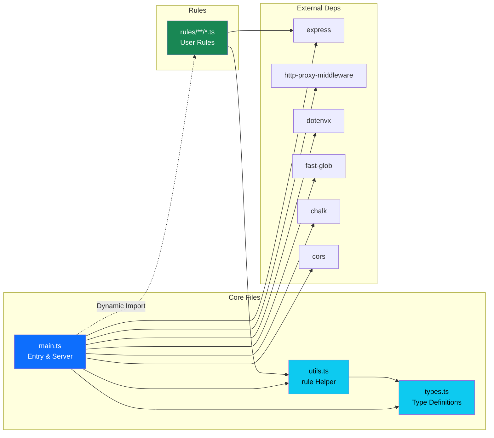
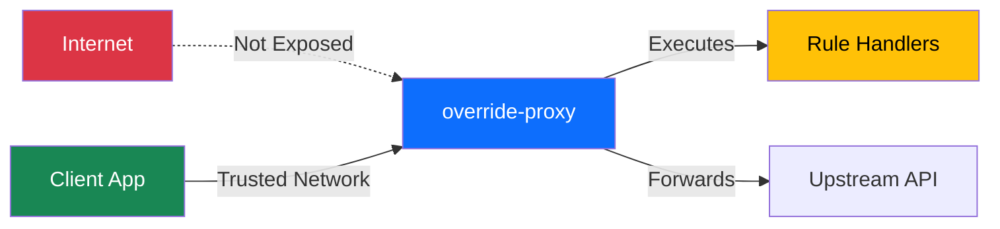

# Architecture

Visual diagrams and code location index for understanding codebase structure and request flow.

## System Overview



## Request Lifecycle



### Key Decision Points

| Point | Code Location | Decision Logic |
|-------|---------------|----------------|
| CORS Check | [main.ts:153-163](../main.ts#L153-L163) | Origin in `CORS_ORIGINS` or allow all |
| Override Match | [main.ts:190-211](../main.ts#L190-L211) | First `rule.test(req) === true` |
| Proxy Fallback | [main.ts:214-236](../main.ts#L214-L236) | No override matched |
| Error Handling | [main.ts:204-208](../main.ts#L204-L208) | Rule handler throws |

## Rule Loading Flow

```mermaid
flowchart TD
    Start([Server Start])
    EnsureDir[Ensure rules/ exists]
    Glob[fast-glob scan<br/>**/*.ts, **/*.js]
    LoopFiles{For Each File}
    Import[Dynamic import file]
    CheckDefault{Has default<br/>export?}
    CheckRules{Has 'rules'<br/>array?}
    CheckNamed{Has other<br/>named exports?}

    CollectDefault[Collect default rule(s)]
    CollectRulesArray[Collect rules array]
    CollectNamed[Collect named export rule(s)]

    AssignName{Export name<br/>exists?}
    SetName[Override rule.name<br/>with export key]
    CreateMeta[Create metadata<br/>file, export, id]
    StoreRule[Add to overrides array<br/>Store in metaMap]

    MoreFiles{More files?}
    SetupExpress[Setup Express app]
    Done([Server Ready])

    Start --> EnsureDir
    EnsureDir --> Glob
    Glob --> LoopFiles

    LoopFiles -->|Yes| Import
    LoopFiles -->|No| SetupExpress

    Import --> CheckDefault
    CheckDefault -->|Yes| CollectDefault
    CheckDefault -->|No| CheckRules

    CheckRules -->|Yes| CollectRulesArray
    CheckRules -->|No| CheckNamed

    CheckNamed -->|Yes| CollectNamed
    CheckNamed -->|No| MoreFiles

    CollectDefault --> AssignName
    CollectRulesArray --> AssignName
    CollectNamed --> AssignName

    AssignName -->|Yes| SetName
    AssignName -->|No| CreateMeta
    SetName --> CreateMeta

    CreateMeta --> StoreRule
    StoreRule --> MoreFiles

    SetupExpress --> Done

    style Import fill:#0d6efd,color:#fff
    style StoreRule fill:#198754,color:#fff
    style Done fill:#198754,color:#fff
```

### Rule Export Patterns

| Pattern | Priority | Example | Notes |
|---------|----------|---------|-------|
| Named export | **Recommended** | `export const UserDetail = rule(...)` | Export name becomes rule name |
| Multiple named | **Recommended** | `export const R1 = ...; export const R2 = ...` | All collected |
| Default export | Legacy | `export default rule(...)` | Still supported |
| `rules` array | Legacy | `export const rules = [...]` | Still supported |

### Ignored by Loader

- Dotfiles: `.hidden.ts`
- Dot folders: `.trash/`, `.wip/`
- Type definitions: `*.d.ts`

**Code:** [main.ts:30-89](../main.ts#L30-L89)

## Module Dependencies



### External Dependencies

| Module | Purpose | Used By |
|--------|---------|---------|
| `express` | HTTP server & routing | main.ts, rules |
| `http-proxy-middleware` | Proxy fallback | main.ts |
| `@dotenvx/dotenvx` | Env loading (.env.local → .env.default) | main.ts |
| `fast-glob` | Rule file discovery | main.ts |
| `chalk` | Colored console output | main.ts |
| `cors` | CORS policy enforcement | main.ts |
| `pathe` | Cross-platform path utils | main.ts |
| `get-port` | Auto port selection | main.ts |

## Code Location Index

### Common Modification Tasks

| Task | File | Lines | What to Change |
|------|------|-------|----------------|
| **Add new middleware** | [main.ts](../main.ts) | After 165 | Insert before override loop |
| **Change rule matching logic** | [main.ts](../main.ts) | 190-211 | Override dispatch loop |
| **Modify proxy behavior** | [main.ts](../main.ts) | 214-236 | Proxy middleware config |
| **Change CORS policy** | [main.ts](../main.ts) | 146-165 | CORS options object |
| **Update log format** | [main.ts](../main.ts) | 107-142 | Log helper functions |
| **Add rule helper overload** | [utils.ts](../utils.ts) | 29-108 | `rule()` function |
| **Add HTTP method** | [types.ts](../types.ts) | 3-10 | `Method` type union |
| **Change rule interface** | [utils.ts](../utils.ts) | 3-16 | `OverrideRule` interface |

### Key Data Structures

| Structure | File | Line | Purpose |
|-----------|------|------|---------|
| `overrides: OverrideRule[]` | [main.ts](../main.ts) | 35 | Global rule list |
| `metaMap: WeakMap<...>` | [main.ts](../main.ts) | 36 | Rule metadata storage |
| `TARGET: string` | [main.ts](../main.ts) | 26 | Upstream proxy target |
| `reqSeq: number` | [main.ts](../main.ts) | 168 | Request ID counter |

### Request/Response Augmentation

Express objects are augmented with custom properties:

```typescript
// Added to res object (using type assertions)
(res as any)._logId: number;                  // Request ID for logging
(res as any)._via: 'override' | 'proxy';      // Response source
(res as any)._matched: string;                 // Matched rule name
```

**Code:** [main.ts:169-186](../main.ts#L169-L186)

## Core Data Structures

### OverrideRule

```typescript
interface OverrideRule {
  name?: string;           // Display name (overridden by export name)
  enabled?: boolean;       // Default: true
  methods: MethodList;     // Non-empty array: ['GET', 'POST', ...]
  test(req: Request): boolean;      // Match predicate
  handler(req, res, next): void | Promise<void>;  // Response handler
}
```

**Defined in:** [utils.ts:3-9](../utils.ts#L3-L9)

### OverrideRuleMeta

Internal metadata, stored separately in `WeakMap`:

```typescript
interface OverrideRuleMeta {
  file: string;            // e.g., "commerce/org1.ts"
  export?: string;         // e.g., "UserDetail" (undefined for legacy)
  id: string;              // e.g., "commerce/org1.ts:UserDetail"
}
```

**Defined in:** [utils.ts:11-16](../utils.ts#L11-L16)

### RuleConfig

Config object form for `rule()` helper:

```typescript
interface RuleConfig {
  name?: string;           // Deprecated - use export name instead
  enabled?: boolean;       // Default: true
  methods?: Method[];      // Default: ['GET']
  path?: string | RegExp;  // One of path or test required
  test?(req): boolean;     // Custom match logic
  handler: RuleHandler;    // Required
}
```

**Defined in:** [utils.ts:20-27](../utils.ts#L20-L27)

## Extension Points

### Middleware Insertion Points

```mermaid
flowchart LR
    Start([Request Arrives])

    subgraph Middleware Chain
        EP1[Extension Point 1:<br/>Before CORS]
        CORS[CORS Check]
        EP2[Extension Point 2:<br/>Before Logging]
        Log[Logger Setup]
        EP3[Extension Point 3:<br/>Before Override]
        Override[Override Loop]
        EP4[Extension Point 4:<br/>Before Proxy]
        Proxy[Proxy Middleware]
    end

    End([Response Sent])

    Start --> EP1
    EP1 --> CORS
    CORS --> EP2
    EP2 --> Log
    Log --> EP3
    EP3 --> Override
    Override --> EP4
    EP4 --> Proxy
    Proxy --> End

    style EP1 fill:#ffc107,stroke:#ff9800,color:#000
    style EP2 fill:#ffc107,stroke:#ff9800,color:#000
    style EP3 fill:#ffc107,stroke:#ff9800,color:#000
    style EP4 fill:#ffc107,stroke:#ff9800,color:#000
```



### Extension Point Details

#### 1. Before CORS (Security, Rate Limiting)

```typescript
// main.ts, after line 165
app.use((req, res, next) => {
  // Rate limiting
  // Authentication
  // Request validation
  next();
});
```

#### 2. Before Logging (Request Enrichment)

```typescript
// main.ts, before line 169
app.use((req, res, next) => {
  // Add request context
  // Parse special headers
  next();
});
```

#### 3. Before Override (Global Overrides)

```typescript
// main.ts, before line 190
app.use((req, res, next) => {
  // Global fallback responses
  // Maintenance mode
  next();
});
```

#### 4. Before Proxy (Last-chance Logic)

```typescript
// main.ts, before line 214
app.use((req, res, next) => {
  // Request transformation
  // Logging unmatched requests
  next();
});
```

### Common Extension Use Cases

| Extension | Location | Example Use Case |
|-----------|----------|------------------|
| Custom built-in routes | Before line 169 | `/__rules`, `/__health` |
| Metrics collection | In logger (line 169-187) | Prometheus, StatsD |
| Request transformation | Before override loop | Add/remove headers |
| Response caching | After override loop | Cache override responses |
| Error reporting | In error handlers | Sentry, Rollbar |
| Hot reload | After rule loading | Watch `rules/` with chokidar |

### Pass-through Rules

Rules can use `next()` for conditional proxying:

```typescript
export const ConditionalOverride = rule({
  path: '/api/data',
  handler: (req, res, next) => {
    if (req.query.mock === '1') {
      res.json({ mocked: true });
    } else {
      next(); // Fall through to proxy
    }
  }
});
```

## Performance Characteristics

### Rule Matching

- **O(n)** linear scan through rules array
- First match wins (short circuit)
- No rule caching or indexing
- **Recommendation:** Place frequently matched rules first

### Optimization Strategies

1. **Rule ordering:** Sort by match frequency
2. **Rule indexing:** Group by path prefix (future enhancement)
3. **Compiled regexes:** Pre-compile RegExp in rule definitions
4. **Method filtering:** Check method before path (already done in `rule()`)

### Known Bottlenecks

| Area | Impact | Mitigation |
|------|--------|------------|
| Dynamic imports | Startup only | Pre-load in production |
| Linear rule scan | Every request | Keep rule count < 100 |
| RegExp tests | Per-rule overhead | Use string paths when possible |

## Security Model

### Trust Boundaries



### Security Boundaries

1. **CORS Enforcement:** [main.ts:146-165](../main.ts#L146-L165)
   - Configurable allowed origins
   - Credentials support

2. **Environment Secrets:** [main.ts:20-21](../main.ts#L20-L21)
   - `.env.local` git-ignored
   - `/__env` redacts sensitive vars

3. **Rule Execution:**
   - Rules execute arbitrary code (trust rule authors)
   - Exceptions caught and logged [main.ts:204-208](../main.ts#L204-L208)

4. **Proxy Errors:** [main.ts:227-233](../main.ts#L227-L233)
   - Generic error messages (no stack leak)
   - 502 status for upstream failures

## Debugging

### Startup Logging

Rules are logged at startup:

```
Server listening http://localhost:4000
Target: https://pokeapi.co/api/v2/
Overrides:
  - DemoHello :: _demo.ts:DemoHello
  - UserAuth :: commerce/org1.ts:UserAuth
  - ChatMessages (off) :: commerce/chat.ts:ChatMessages
```

### Request Tracing

Each request gets a unique ID:

```
[1] -> GET /api/users
[1] match UserAuth (commerce/org1.ts:UserAuth)
[1] <- 200 12ms override UserAuth
```

### Common Issues

| Symptom | Diagnosis | Solution |
|---------|-----------|----------|
| Rule not listed | Import error | Check console for import exceptions |
| Rule listed but not matching | `test()` returns false | Add console.log in `test()` |
| 500 error | Rule handler threw | Check error in log: `[id] ERROR ruleName ...` |
| CORS error | Origin not allowed | Check `CORS_ORIGINS` matches exactly |
| Port conflict | Preferred port busy | Check log: `Port 4000 busy -> selected 4001` |

## Quick Reference

### File Purposes

| File | Purpose | Modify When... |
|------|---------|----------------|
| `main.ts` | Server entry, rule loading, middleware | Adding middleware, changing server behavior |
| `utils.ts` | `rule()` helper, types | Adding rule features, new rule patterns |
| `types.ts` | TypeScript types | Adding HTTP methods, new types |
| `rules/**/*.ts` | Override rules | Adding/editing API mocks |
| `.env.local` | Local secrets | Setting up your environment |
| `.env.default` | Committed defaults | Adding new env vars |

### One-Liner Changes

| Want to... | Edit | Change |
|------------|------|--------|
| Add a new rule | `rules/yourfile.ts` | `export const X = rule(...)` |
| Change proxy target | `.env.local` | `PROXY_TARGET=https://...` |
| Change port | `.env.local` | `PORT=5000` |
| Restrict CORS | `.env.local` | `CORS_ORIGINS=http://localhost:3000` |
| Disable rule temporarily | Rule file | `enabled: false` |
| Disable rule group | Folder | Rename to `.foldername` |
