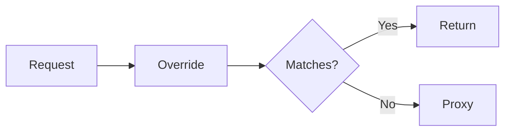

# Documentation Writing Guide

Best practices for writing and maintaining documentation in this project.

## Core Principles

### 1. Clarity Over Completeness

**Write for people with context** - Assume readers have basic understanding of the project. Don't explain everything from scratch.

✅ Good:
```markdown
## Rule Loading Flow

Rules are discovered via fast-glob, dynamically imported, and stored in the global overrides array.
```

❌ Avoid:
```markdown
## Rule Loading Flow

This section explains how the rule loading mechanism works in override-proxy. When the server starts up, it needs to find all the rule files that users have created. To do this, we use a library called fast-glob which scans directories...
```

**Why:** Readers can infer context. Verbose explanations slow them down.

---

### 2. Descriptive Titles

Titles should be **self-explanatory** without reading the content.

✅ Good:
```markdown
## Request Lifecycle
## Code Location Index
## Common Modification Tasks
## Extension Points
```

❌ Avoid:
```markdown
## Overview
## Details
## More Information
## Miscellaneous
```

**Pattern:** Use `<Noun>` or `<Action> <Noun>` format, not vague labels.

---

### 3. No Metadata Clutter

Remove unnecessary administrative content:

❌ **Never include:**
- Table of Contents (use Markdown headers for navigation)
- "Last updated: [date]" footers
- "Author: [name]" sections
- Changelog in documentation (use git history or separate CHANGELOG file)
- "Next Steps" navigation links at the end

✅ **Only include:**
- Core content
- Code examples
- Tables/diagrams
- Cross-references when necessary

**Why:** Metadata becomes stale, adds noise, and provides little value. Git tracks history better.

---

### 4. American English

Use American English spelling consistently:

| ✅ Use | ❌ Avoid |
|--------|----------|
| organize | organise |
| color | colour |
| behavior | behaviour |
| optimize | optimise |
| analyze | analyse |

**Tools:** Configure editor spell-checker to `en-US`.

---

### 5. Iterative Structure (Not Append-Only)

When adding new content, **always ask:**

> "Does this fit the current structure, or should I refactor?"

#### Refactor Triggers

**Trigger 1: Section Too Long**
- If a section exceeds ~300 lines, split it
- Create subsections or separate documents

**Before:**
```markdown
## Examples

### 1. Basic Example
[100 lines]

### 2. Advanced Example
[100 lines]

### 3. Complex Example
[100 lines]
...
### 27. Another Example
```

**After:**
```markdown
## Examples

See [EXAMPLES.md](EXAMPLES.md) for comprehensive examples organized by scenario.
```

---

**Trigger 2: Multiple Related Items**
- If you have 3+ similar items, group them

**Before:**
```markdown
## Creating Rules
...

## Deleting Rules
...

## Updating Rules
...

## Testing Rules
...
```

**After:**
```markdown
## Rule Management

### Creating Rules
...

### Updating Rules
...

### Deleting Rules
...

### Testing Rules
...
```

---

**Trigger 3: Nested Depth > 3**
- If you have #### ##### ###### nesting, split the file

**Before:**
```markdown
## Section
### Subsection
#### Sub-subsection
##### Sub-sub-subsection
###### Too deep!
```

**After:** Move deep sections to separate files or flatten hierarchy.

---

**Trigger 4: Unrelated Content in Same File**
- If sections serve different purposes, split them

**Before (README.md):**
```markdown
## Quick Start
## Architecture Details
## API Reference
## Troubleshooting
## Internal Implementation
## Future Roadmap
```

**After:**
```
README.md → Quick Start, Overview
ARCHITECTURE.md → Architecture, Implementation
API.md → API Reference
TROUBLESHOOTING.md → Troubleshooting
```

---

#### Refactoring Strategies

**Strategy 1: Extract by Purpose**

Group content by reader intent, not by topic.

```
docs/
├── GETTING-STARTED.md   # "I want to start using this"
├── EXAMPLES.md          # "I want to copy an example"
├── PATTERNS.md          # "I want to do it correctly"
├── TROUBLESHOOTING.md   # "Something is broken"
└── REFERENCE.md         # "I need detailed specs"
```

**Strategy 2: Progressive Disclosure**

Start simple, link to details.

```markdown
## Configuration

Basic setup in `.env.local`:
```bash
PORT=4000
```

For advanced options, see [CONFIGURATION.md](CONFIGURATION.md).
```

**Strategy 3: Consolidate Duplicates**

If you're repeating yourself, create a single source of truth.

**Before:**
- README mentions rule syntax
- AGENTS.md mentions rule syntax
- EXAMPLES.md shows rule syntax

**After:**
- ARCHITECTURE.md defines rule syntax (canonical)
- Others link to it

---

### 6. Visual Hierarchy

Use formatting to guide the eye:

#### Use Tables for Comparisons

✅ Good:
```markdown
| Task | Tool | When to Use |
|------|------|-------------|
| Create rule | `/rule` | Always |
| Debug rule | `/rule-diagnose` | When broken |
```

❌ Avoid:
```markdown
You can use /rule to create rules which is good when you want to make a new rule.
You can use /rule-diagnose to debug rules when something is broken.
```

#### Use Code Blocks for Examples

Always include:
1. Context (what this does)
2. Code
3. Expected output (if relevant)

```markdown
Test the auth endpoint:

```bash
curl http://localhost:4000/api/auth/me \
  -H "Authorization: Bearer token"
```

Expected: `200 OK` with user data
```

#### Use Diagrams for Flow

Prefer Mermaid diagrams over text descriptions for processes.

✅ Good:


❌ Avoid:
```
First the request comes in, then it checks the override rules.
If it matches, it returns immediately. Otherwise, it proxies to upstream.
```

#### Use Callouts for Important Info

```markdown
> **Note:** This requires server restart.

> **Warning:** Do not commit secrets in `.env.local`.
```

---

### 7. Cross-References

Link to other docs when needed, but avoid link spam.

✅ Good:
```markdown
For implementation patterns, see [PATTERNS.md](PATTERNS.md).
```

❌ Avoid:
```markdown
See [ARCHITECTURE.md](ARCHITECTURE.md), [EXAMPLES.md](EXAMPLES.md),
[PATTERNS.md](PATTERNS.md), [TOOLS.md](TOOLS.md), and [README.md](README.md)
for more information.
```

**Guideline:** Maximum 1-2 cross-references per section.

---

### 8. Code Examples Must Be Runnable

Every code example should be:
- **Complete** - No `...` or `// more code`
- **Tested** - Actually works
- **Minimal** - Only what's needed

✅ Good:
```typescript
export const UserDetail = rule({
  methods: ['GET'],
  path: /^\/api\/users\/(\d+)$/,
  handler: (req, res) => {
    const match = req.path.match(/^\/api\/users\/(\d+)$/);
    const id = match ? match[1] : 'unknown';
    res.json({ id, name: `User ${id}` });
  },
});
```

❌ Avoid:
```typescript
export const UserDetail = rule({
  // Configure your rule here
  ...
  handler: (req, res) => {
    // Add your logic
  }
});
```

---

### 9. File Naming Conventions

| File Type | Naming Pattern | Example |
|-----------|---------------|---------|
| Overview | `README.md` | Project root |
| Specific topic | `TOPIC.md` | `ARCHITECTURE.md` |
| Plural collections | `TOPICS.md` | `EXAMPLES.md`, `PATTERNS.md` |
| How-to guides | `VERB-NOUN.md` | `WRITING-GUIDE.md` |
| Reference | `API.md`, `REFERENCE.md` | API specs |

**Guidelines:**
- Use UPPERCASE for top-level docs (README, ARCHITECTURE)
- Use lowercase for auxiliary docs in subdirs (contributing.md, changelog.md)
- Use hyphens, not underscores: `writing-guide.md` not `writing_guide.md`

---

### 10. Document Organization

#### Small Projects (< 10 docs)

Flat structure:
```
project/
├── README.md
├── ARCHITECTURE.md
├── EXAMPLES.md
└── CONTRIBUTING.md
```

#### Medium Projects (10-30 docs)

Group by purpose:
```
project/
├── README.md
├── CONTRIBUTING.md
└── docs/
    ├── architecture/
    ├── examples/
    ├── guides/
    └── reference/
```

#### Large Projects (30+ docs)

Deep hierarchy:
```
project/
├── README.md
└── docs/
    ├── getting-started/
    │   ├── installation.md
    │   └── quick-start.md
    ├── guides/
    │   ├── beginner/
    │   ├── advanced/
    │   └── expert/
    └── reference/
        ├── api/
        └── cli/
```

**This project:** Medium structure (docs/ folder with topic-based files)

---

## Maintenance Workflow

### When to Update Docs

Update docs **immediately** when:
- ✅ Adding new feature → Update examples, patterns
- ✅ Changing API → Update architecture, reference
- ✅ Fixing bug → Update troubleshooting if pattern
- ✅ Deprecating feature → Mark deprecated, link alternative

**Don't wait** for a "docs sprint". Docs are part of the feature.

---

### Update Index Files

**Critical:** When adding, removing, or moving documentation files, always update:

1. **README.md** - Update the Documentation table with new file links and descriptions
2. **AGENTS.md** - Update the Documentation Quick Links section with appropriate categorization

**When to update indexes:**
- ✅ Created new doc file → Add to both indexes
- ✅ Renamed/moved doc file → Update paths in both indexes
- ✅ Changed doc purpose → Update descriptions in both indexes
- ✅ Deleted doc file → Remove from both indexes

**Why this matters:** README and AGENTS are entry points. Stale links or missing entries break discoverability.

---

### Review Checklist

Before committing doc changes:

- [ ] Titles are descriptive (no "Overview", "Details")
- [ ] No Table of Contents
- [ ] No author/date metadata
- [ ] American English spelling
- [ ] Code examples are complete and tested
- [ ] Structure makes sense (didn't just append)
- [ ] Cross-references are minimal and relevant
- [ ] No broken links
- [ ] No duplicate content
- [ ] **README.md and AGENTS.md indexes updated** (if files added/removed/moved)

---

### Refactoring Schedule

**Quarterly Review:**
1. Check for duplicate content → Consolidate
2. Check for outdated content → Update or remove
3. Check for missing content → Add to backlog
4. Check for poor structure → Refactor

**Signs docs need refactoring:**
- Files exceed 500 lines
- Frequent "see also" links between same files
- Sections with generic titles ("Other", "Miscellaneous")
- Complaints about "can't find X in docs"

---

## Common Anti-Patterns

### ❌ The Encyclopedia

**Problem:** Trying to document everything exhaustively.

```markdown
## HTTP Methods

HTTP methods, also known as HTTP verbs, are used to indicate the desired
action to be performed on a resource. The most common methods are GET, POST,
PUT, PATCH, and DELETE. GET is used for retrieving data...
[500 more words]
```

**Fix:** Assume basic knowledge. Link to external docs for fundamentals.

```markdown
## HTTP Methods

Supported methods: GET, POST, PUT, PATCH, DELETE, HEAD, OPTIONS.

Configure in the `methods` array:
```typescript
rule({ methods: ['GET', 'POST'], ... })
```
```

---

### ❌ The Changelog Novel

**Problem:** Documenting every change in the docs.

```markdown
## Version History

### 2025-01-14
- Added section on rule loading
- Updated example 3
- Fixed typo in section 2.1

### 2025-01-13
- Initial draft
```

**Fix:** Use git history. Only track breaking changes if needed.

---

### ❌ The Dead Link Cemetery

**Problem:** Links that used to work but broke during refactoring.

```markdown
See the [old architecture doc](docs/old-arch.md) for details.
```

**Fix:** Update or remove links during refactoring. Use relative paths.

---

### ❌ The Scattered Truth

**Problem:** Same information in multiple places, inconsistent versions.

**Example:**
- README says rules use `name` property
- ARCHITECTURE says use export name
- EXAMPLES shows both
- PATTERNS recommends export name

**Fix:** Pick one canonical location. Others link to it.

---

### ❌ The Append Monster

**Problem:** Adding new sections at the end without reorganizing.

**Before:**
```markdown
## Section 1
## Section 2
## Section 3
## New Unrelated Thing (just added!)
## Another New Thing
## Yet Another Thing
```

**After refactoring:**
```markdown
## Category A
### Section 1
### New Thing (moved here, related to A)

## Category B
### Section 2
### Another Thing (moved here, related to B)

## Category C
### Section 3
### Yet Another Thing (moved here, related to C)
```

---

## Templates

### New Documentation Template

```markdown
# [Clear Title]

[1-2 sentence description of what this doc covers]

## [First Main Topic]

[Content with examples, tables, or diagrams]

## [Second Main Topic]

[Content]

## [Third Main Topic]

[Content]
```

**No more than 4-5 main sections.** If you need more, split the file.

---

### Example Template

```markdown
### [Number]. [Short Description]

**Scenario:** [When/why you'd use this]

```typescript
// Full, runnable code
```

**Test:**
```bash
curl http://localhost:4000/api/endpoint
```

**Expected Output:**
```json
{ "result": "..." }
```
```

---

### Pattern Template

```markdown
### Pattern: [Name]

**Problem:** [What issue this solves]

❌ **Avoid:**
```typescript
// Bad example
```

✅ **Use:**
```typescript
// Good example
```

**Why:** [Explanation]
```

---

## Tools

### Linters

Use markdown linters to enforce consistency:

```bash
# Install
npm install -g markdownlint-cli

# Run
markdownlint docs/**/*.md

# Config (.markdownlint.json)
{
  "MD013": false,  # Allow long lines
  "MD033": false,  # Allow HTML (for callouts)
  "MD041": false   # Don't require h1 first
}
```

### Link Checkers

```bash
# Install
npm install -g markdown-link-check

# Run
markdown-link-check docs/**/*.md
```

### Spell Check

Configure VS Code spell checker:

```json
{
  "cSpell.language": "en-US",
  "cSpell.words": [
    "override-proxy",
    "dotenvx",
    "nodemon"
  ]
}
```

---

## Example: Before & After

### Before (Poor Structure)

```markdown
# Documentation

## Table of Contents
1. Introduction
2. Getting Started
3. Advanced Topics
...

## 1. Introduction
This is override-proxy...

## 2. Getting Started
...

## 15. Random Tips
- Tip 1
- Tip 2

## 16. More Examples
...

## 17. Troubleshooting
...

Last updated: 2025-01-14
Author: Team
```

**Problems:**
- ❌ Table of Contents
- ❌ Generic section titles
- ❌ Unorganized (tips, examples, troubleshooting mixed)
- ❌ Metadata footer

---

### After (Good Structure)

**README.md:**
```markdown
# override-proxy

Override-first development server for API mocking.

## Quick Start

```bash
pnpm install
pnpm dev
```

## Documentation

| Document | Purpose |
|----------|---------|
| [ARCHITECTURE.md](docs/ARCHITECTURE.md) | System design |
| [EXAMPLES.md](docs/EXAMPLES.md) | Copy-paste examples |
| [TROUBLESHOOTING.md](docs/TROUBLESHOOTING.md) | Common issues |

...
```

**docs/EXAMPLES.md:**
```markdown
# Examples

Practical examples organized by scenario.

## Basic Path Matching

### 1. Simple Static Response

```typescript
export const Hello = rule('GET', '/api/hello', (req, res) => {
  res.json({ message: 'Hello!' });
});
```

Test: `curl http://localhost:4000/api/hello`

...
```

**Changes:**
- ✅ Split into focused files
- ✅ Descriptive titles
- ✅ No ToC, no metadata
- ✅ Organized by purpose

---

## Summary

**Golden Rules:**
1. **Clarity** - Write for people with context
2. **Structure** - Refactor, don't append
3. **Minimal** - No metadata clutter
4. **Consistent** - American English, conventions
5. **Actionable** - Complete, tested examples
6. **Organized** - Right place for right content

**When in doubt:**
> Will a developer with basic project knowledge understand this title and find what they need in < 30 seconds?

If no, refactor.
